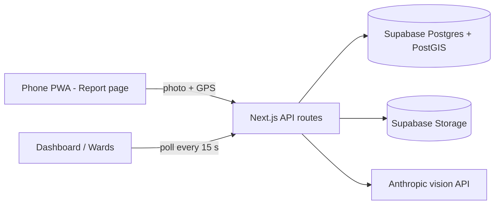

# Ward Watch

**Report a civic problem with one photo.** AI classifies and rates it, nearby duplicates merge automatically, and the municipality sees a live, priority-ranked map. When a worker fixes it, an after-photo is verified by AI before the ticket can close.

Hack-A-Throne | Sustainability and Smart Cities

## Problem
Civic issues are reported through calls and WhatsApp photos with no location, category or severity. Officials can't tell what is urgent, duplicates flood the queue, tickets get closed without being fixed, and citizens never see an outcome.

## Features (mapped to judging criteria)
| Criterion | What Ward Watch does |
|---|---|
| Innovation | Geo-dedupe plus AI-verified closure: a ticket can't be closed falsely |
| Technical implementation | PostGIS `ST_DWithin` dedupe in one transaction, vision LLM with validated JSON output, typed API routes |
| Usability | One-tap report: camera, automatic GPS, no forms, mobile-first, installable PWA |
| Real-world impact | Priority-ranked triage for officers and a public ward leaderboard |
| Scalability | Category-agnostic pipeline, ward model from JSON, map centre from env (multi-city) |

## Architecture

The browser never talks to Supabase. All DB and storage access goes through API routes using the service-role key; RLS is on with no policies.

## How it works
- **Dedupe:** `report_issue()` merges a report into an existing issue if it is the same category, not resolved, and within 30 m (`ST_DWithin`). It takes a per-category advisory lock so simultaneous reports can't both create an issue. A merge raises `report_count` and keeps the max severity.
- **Priority:** `ageFactor = 1 + min(ageDays, 14) / 7`; `priority = round(severity x report_count x ageFactor, 1)`; resolved = 0. Bands: critical >= 20, high >= 10, medium >= 5, else low.
- **Verified resolution:** the after-photo and original are sent to the model. The issue only closes if `resolved` is true and `confidence >= 0.6`; otherwise the reason is stored and the status stays.
- **Mock AI:** with no `ANTHROPIC_API_KEY` (or after an API failure) deterministic mock results are used and the UI shows a **Demo AI** badge, so the app never goes dead.

## Setup
Prerequisites: Node 20+, a Supabase project.

1. `cp .env.example .env.local` and fill in the values (never commit it).
2. In the Supabase SQL editor, run `supabase/schema.sql`. Confirm the public `photos` bucket exists.
3. `npm install`
4. `npm run dev` (http://localhost:3000)
5. Seed demo data: `npm run seed -- --reset`
6. Test: `node scripts/smoke.mjs` (set `BASE_URL`, and `ADMIN_PASSCODE` if you set one)

| Variable | Purpose |
|---|---|
| `SUPABASE_URL`, `SUPABASE_SERVICE_ROLE_KEY` | Server-only DB/storage access |
| `ANTHROPIC_API_KEY`, `ANTHROPIC_MODEL` | Optional; empty = mock AI. Default model `claude-sonnet-5-5` |
| `NEXT_PUBLIC_MAP_CENTER` | `lat,lng` for map and seed (set to your campus/city) |
| `DEDUPE_RADIUS_M` | Merge radius, default 30 |
| `ADMIN_PASSCODE` | Protects assign/resolve |

### Deploy
Push to GitHub, import into Vercel, set all variables (Production and Preview), deploy, then run `BASE_URL=https://your-app.vercel.app node scripts/smoke.mjs` and seed production once.

## Demo access
- Live URL: _add after deploying_
- Admin passcode for judges: _set `ADMIN_PASSCODE` in Vercel and write it here_

## Limitations and next steps
- No authentication beyond the demo passcode.
- The in-memory rate limiter is per-instance and resets on cold starts.
- Ward assignment uses nearest-centroid placeholders; production should use real ward polygons (GeoJSON, point-in-polygon).
- AI can misclassify, so officers keep the final say.
- Next: real authentication, notifications, multilingual UI, municipal API integration, offline queue.
